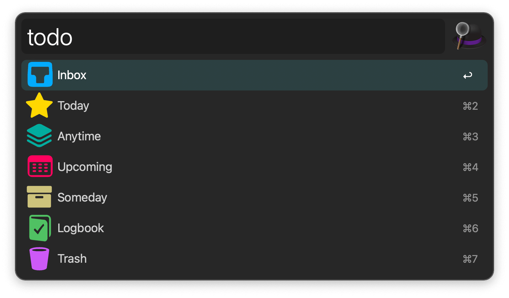
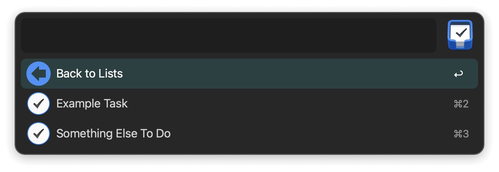

<h1 align="center">Things for Alfred</h1>

  
  
  

Interact with [Things][1] using [Alfred][2].

## Usage

Show your Things lists via the `todo` keyword.

<kbd>↩&#xFE0E;</kbd>: Show list items.  
<kbd>⌘</kbd><kbd>↩&#xFE0E;</kbd>: Open in Things.  
<kbd>⌥</kbd><kbd>↩&#xFE0E;</kbd>: Open Quick Entry window.  
<kbd>⌃</kbd><kbd>↩&#xFE0E;</kbd>: Show tags in list.  
<kbd>fn</kbd><kbd>↩&#xFE0E;</kbd>: Empty Trash.
  
When displaying the contents of a list, new actions become available.

<kbd>↩&#xFE0E;</kbd>: Open in Things.  
<kbd>⌘</kbd><kbd>↩&#xFE0E;</kbd>: Mark completed.  
<kbd>⌥</kbd><kbd>↩&#xFE0E;</kbd>: Mark canceled.  
<kbd>⌃</kbd><kbd>↩&#xFE0E;</kbd>: Delete.  
<kbd>fn</kbd><kbd>↩&#xFE0E;</kbd>: Empty Trash.  
<kbd>⇧</kbd><kbd>↩&#xFE0E;</kbd>: Show to-dos in project.

## Contribute

To report a bug or request a feature, please [create an issue][3] or
[submit a pull request][4].

## Credits

The to-do icon is created by [Jason Zigrino][5] and released under the
[Creative Commons BY-NC-ND 3.0 license][6].

[1]:https://culturedcode.com/things/
[2]:http://www.alfredapp.com/
[3]:https://github.com/xilopaint/alfred-things/issues
[4]:https://github.com/xilopaint/alfred-things/pulls
[5]:https://jasonzigrino.deviantart.com
[6]:https://creativecommons.org/licenses/by-nc-nd/3.0/legalcode
