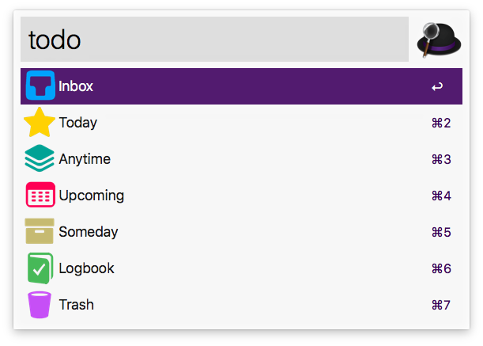

# Things for Alfred

Interact with [Things 3][1] using [Alfred][2].

## Download and Installation

Download the workflow file from [GitHub releases][3] and install it by double-clicking on `Things.alfredworklow`.

## Usage

* Use the keyword `todo` to show Things lists and press `↩` to explore the contained to-dos of the selected list. The following modifier keys can be used to trigger actions in lists:
  * `⌘ + ↩` to show the selected list in Things UI;
  * `⌥ + ↩` to add a to-do to the selected list;
  * `⌃ + ↩` to show tags in the target list;
  * `fn + ↩` to empty the Trash.

* Select a to-do and press `↩` for displaying it in Things UI. The following modifier keys can be used to trigger actions in to-dos:
  * `⌘ + ↩` to mark a to-do as completed;
  * `⌥ + ↩` to mark a to-do as canceled;
  * `⌃ + ↩` to delete a to-do;
  * `fn + ↩` to empty the Trash.

## Contribute

To report a bug or request a feature, please [create an issue][4] or [submit a pull request][5].

## Credits

This workflow relies on [OneUpdater][6] by Vítor Galvão. The to-do icon is created by [Jason Zigrino][7] and released under the [Creative Commons BY-NC-ND 3.0 license][8].

## License

**Things** workflow is released under the [MIT License][9].

[1]:https://culturedcode.com/things/
[2]:http://www.alfredapp.com/
[3]:https://github.com/xilopaint/alfred-things/releases/latest
[4]:https://github.com/xilopaint/alfred-things/issues
[5]:https://github.com/xilopaint/alfred-things/pulls
[6]:https://github.com/vitorgalvao/alfred-workflows/tree/master/OneUpdater
[7]:https://jasonzigrino.deviantart.com
[8]:https://creativecommons.org/licenses/by-nc-nd/3.0/legalcode
[9]:https://opensource.org/licenses/MIT
