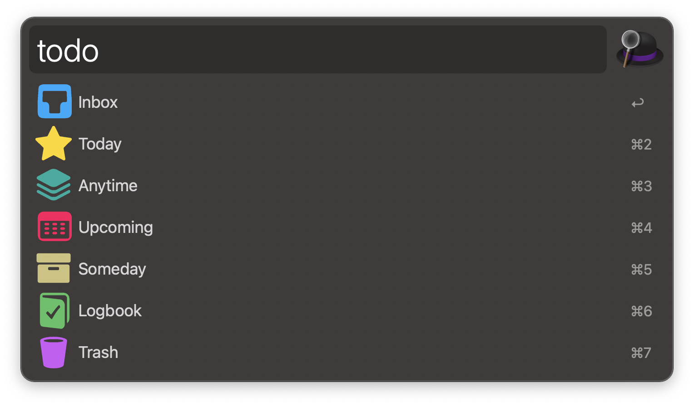

# Things for Alfred

Interact with [Things 3][1] using [Alfred 3][2].

## Download and Installation

Download the workflow file from [GitHub releases][3] and install it by double-clicking on `Things.alfredworklow`.

## Usage

* Use the keyword `todo` to show Things lists and action any of them for displaying the corresponding to-dos.
* Action a to-do to display it in the Things UI.
* Try the modifier keys either in lists or in to-dos to know other actions.

## Contribute

To report a bug or request a feature, please [create an issue][4] or [submit a pull request][5] on GitHub.

## Credits

This workflow relies on [OneUpdater][6] and [Notificator][7] by Vítor Galvão and [qWorkflow][8] library by Ursan Razvan.

## License

**Things** workflow code is released under the [MIT License][9].

[1]:https://culturedcode.com/things/
[2]:http://www.alfredapp.com/
[3]:https://github.com/xilopaint/alfred-things/releases/latest
[4]:https://github.com/xilopaint/alfred-things/issues
[5]:https://github.com/xilopaint/alfred-things/pulls
[6]:https://github.com/vitorgalvao/alfred-workflows/tree/master/OneUpdater
[7]:https://github.com/vitorgalvao/notificator
[8]:https://github.com/qlassiqa/qWorkflow
[9]:https://opensource.org/licenses/MIT
